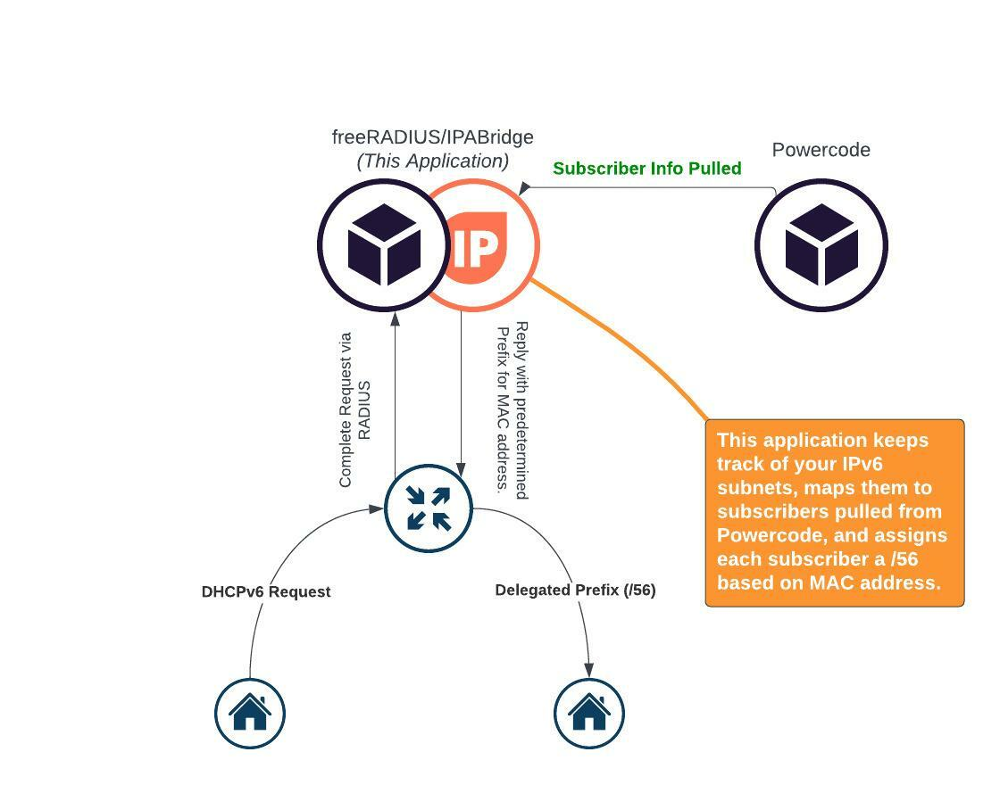

IP ArchiTechs designs, builds, and troubleshoots IPv4 and IPv6 networks for internet service providers, enterprise, and datacenter networks.

Our global consulting team has helped hundreds of network solve scale and management challenges as they grow their network and customer base.

Clients call on IP ArchiTechs to perform network audits, analysis, design expansions, migrate architectures, and more.  We solve business goals and reduce network CAPEX by being vendor and manufacturer agnostic.

Call +1 (855) 645-7684 or email consulting@iparchitechs.com to see how we can help your network and operations thrive.

# Project Description
This application is aimed for wireless and fiber internet service providers that are powered by Powercode.

This application enabled networks to provision IPv6 to customers with predetermined addresses and prefixes using DHCPv6-PD.

This is accomplished using RADIUS as a backend for DHCPv6 and is quite simple to deploy.

## Background
We've assisted hundreds of networks in IPv6 deployment and solve the unique challenges in each organization.  Over those projects, we've developed many tools, utilities, and other enabling material specific to our individual client.

This IPA Bridge for Powercode is released open source to help all Powercode customers enable IPv6 in their network and for their subscribers without compromising on standards or the pre-deterministic nature of IPv4 that you are used to.

## High Level Diagram

## Future
This tool currently is focused on enabling IPv6 for Powercode networks.  However, it has been built to provide other benefits in the future.  Such as Queue Tree based shaping in MikroTik, an alternative to MikroTik BMU capabilities that could be more robust than native integration, netElastic or other BNG support.

# Requirements

## Powercode
This tool is intended to be used with Powercode.  We may support other platforms in the future.

## VM
A small server or VM is required to run this application.

- Ubuntu 20.04 LTS Server
- 2G RAM
- 15G Disk
- 2 CPU Cores (More is great, but beyond 4 would be a waste.)

## Network
Your network must be IPv6 ready.  This application only handles the subscriber CPE, home router provisioning of IPv6 delegated prefixes.

If you need assistance with planning and executing your IPv6 rollout across your infrastructure, protocol support, dynamic routing, or more, call +1 (855) 645-7684 or email consulting@iparchitechs.com.  Our network consulting firm would be delighted to engage with you in deploying IPv6 correctly.

# Operation
Documentation is currently light as we're still working on cleaning up and optimizing functionality.  However, at a high level, it goes something like this;
1. On a new VM, install this application and freeRADIUS.
2. Configure this application to hit a local MySQL database, freeRADIUS MySQL database, and the MySQL server on your Powercode server.
3. Create an IPv6 subnet in this application, usually a /40 based on most designs for WISPs.
4. Map the Powercode Address Ranges that will be handled by that Subnet you created.
5. Sync
6. Configure tower MikroTiks or VPLS termination MikroTiks for DHCPv6, using RADIUS.

*Absolutely nothing needs to be done with **Powercode**.  This application does not touch or interfere with Powercode in any way.  It is also important to note that Powercode may refuse support in operation of this application as this is a third party tool.  For all support, please contact IP ArchiTechs (consulting@iparchitechs.com).*

# Support
While the application is open source, for best results, please contact IP ArchiTechs to plan your deployment with best practices.

+1 (855) 645-7684 or email consulting@iparchitechs.com

# TODO
- Documentation
- Powercode Webhook Support For Incremental Changes
- Optimize Sync actions to only process changes.
- Error Handling
- A Simple Web GUI
- Preseem Integration
- Saisei Integration
- Logging Of Changes and Assignments
- Logging of RADIUS requests for DHCPv6

Ongoing: Remove and refactor laziness out of the code.
